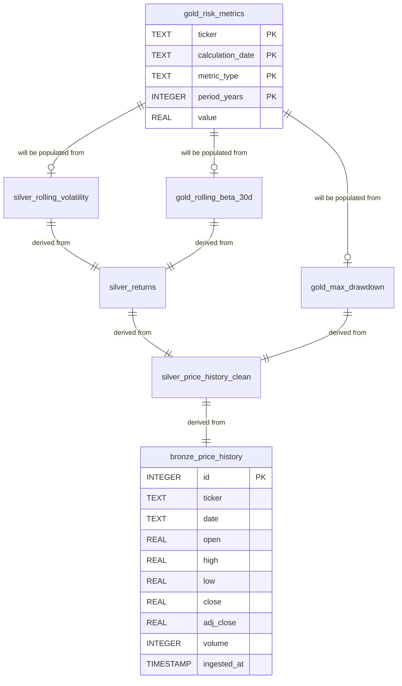

# Stock Risk Engine

A professional-grade financial data pipeline built to analyze volatility and market sensitivity (β) using a Medallion Architecture on SQLite.

## Overview

The Stock Risk Engine is a comprehensive financial analytics platform that ingests stock market data, calculates key risk metrics, and provides insights into portfolio volatility and market correlations. The system implements a structured data lake approach ensuring data lineage and mathematical integrity at every layer.

### Architecture Diagram


## Author and Developer

Venkat Rajadurai

## Architecture Overview

This project implements a Medallion Architecture for financial data processing:

* **Bronze Layer (Raw):** Immutable ledger of raw yfinance ingestion. Includes OHLCV data for equities and key macro indicators (Treasury Yields, VIX, S&P 500)
* **Silver Layer (Cleansed):** Deduplicated time-series data with standardized return calculations and rolling volatility metrics.
* **Gold Layer (Analytics):** High-value business logic including Rolling Beta calculations and Portfolio Stress Testing models.

## Key Quantitative Features

### 1. Rolling Volatility
Calculates the 30-day annualized standard deviation of returns. This helps identify "Volatility Regimes" where a stock's risk profile shifts independently of the market.

σₐₙₙᵤₐₗ = σₔₐᵢₗᵧ × √252

### 2. Rolling Market Beta (β)
Measures the systematic risk of an asset in relation to the S&P 500.
- β > 1: High sensitivity (Aggressive Growth)
- β < 1: Low sensitivity (Defensive/Value)
- β < 0: Inverse correlation (Hedge assets)

### 3. Historical Stress Testing
A simulation engine that identifies the "Maximum 5-Day Drawdown" for a custom-weighted portfolio, providing a realistic view of tail risk during historical market shocks.

## Sample Visualizations

Here are some sample visualizations generated by the `app_visualizer.py` module:

### Portfolio Correlation Matrix


### Risk Analysis Dashboard


### Risk Analysis with Panic Overlay


## Tech Stack

* **Language:** Python 3.x
* **Database:** SQLite (File-based, serverless architecture)
* **Data Source:** Yahoo Finance API (yfinance)
* **Libraries:** Pandas, NumPy, SQLAlchemy, SciPy, StatsModels, Matplotlib, Seaborn

## Project Structure

```
stock-risk-engine/
│   .gitignore
│   environment.yml         # Conda environment configuration
│   init_project.sh         # Project initialization script
│   README.md               # Project documentation
│   LICENSE                 # Project license
│   requirements.txt        # Python dependencies
│   run_pipeline.sh         # Pipeline execution script
│
├───config/
│       tickers.yml        # Configuration for stock tickers
│
├───data/
│   │   stock_risk_vault.db # SQLite database file
│   │
│   └───bronze/             # Raw data storage location
│
├───docs/
│       Portfolio Coorelation Matrix.png     # Portfolio correlation visualization
│       Risk Analysis Dashboard.png          # Risk analysis dashboard
│       Risk Analysis with Panic Overlay.png # Risk analysis with panic overlay
│       Stock_Risk_Engine_Architecture.png   # Architecture diagram image
│
├───sql/
│       init_analytics_layer.sql  # SQL script for analytics layer
│
└───src/
    │   __init__.py        # Package initialization
    │   app_visualizer.py  # Visualization module for risk metrics
    │   config.py          # Configuration utilities (ex. DB File Setup)
    │   database.py        # Database schema creation
    │   ingestion.py       # DataIngestor class for fetching and saving data
    │   main.py            # Main entry point for running the pipeline
    │   maintenance.py     # Maintenance tasks (e.g., archiving)
    │   setup_db.py        # Database setup utilities
```

## 🚀 Getting Started

**1. Clone the repo:** `git clone <your-repo-url>`<br>
**2. Setup Conda:** `conda env create -f environment.yml`<br>
**3. Configure Tickers:** Edit `config/tickers.yml` to track your preferred assets.<br>
**4. Run Script:** `./run_pipeline.sh` (This builds the Bronze/Silver/Gold layers).<br>
**5. View Dashboard:** `python src/app_visualizer.py`<br>

## Installation & Setup

### Prerequisites
- Python 3.8+
- pip package manager

### Installation Steps

1. **Clone or download the project**
   ```bash
   cd /path/to/your/projects
   # Assuming you have the project folder
   cd stock-risk-engine
   ```

2. **Install dependencies**
   ```bash
   pip install -r requirements.txt
   ```

3. **Initialize the project structure** (optional, if starting fresh)
   ```bash
   chmod +x init_project.sh
   ./init_project.sh
   ```

4. **Set up the database**
   ```bash
   python src/setup_db.py
   ```

## Usage

### Data Ingestion

Run the main pipeline script to fetch stock data from Yahoo Finance and process it:

```bash
python main.py
```

This script will:
- Fetch data for predefined stocks (NVDA, TSLA, XOM, CVX, PG)
- Fetch macro indicators (^TNX, ^IRX, ^GSPC, ^IXIC, ^VIX)
- Save data to the bronze layer in SQLite
- Clean up duplicate entries
- Build analytical views for silver and gold layers
- Perform maintenance tasks like archiving old data

### Custom Data Ingestion

You can modify `main.py` or the ingestion logic in `src/ingestion.py` to fetch data for different stocks or date ranges:

```python
from src.ingestion import DataIngestor
import sqlite3

# Connect to database
conn = sqlite3.connect("data/stock_risk_vault.db")
ingestor = DataIngestor(conn)

# Fetch custom stocks
data = ingestor.fetch_stock_data(['AAPL', 'GOOGL'], '2023-01-01', '2024-01-01')
ingestor.save_to_bronze(data)

# Clean up duplicates
ingestor.cleanup_duplicates()
```

### Entity-Relationship Diagram (ERD)



## Data Dictionary

### Bronze Layer Tables

#### Table: bronze_price_history
| Column | Data Type | Description |
|:--------|:----------|:------------|
| ticker | TEXT | Company ticker symbol |
| date | TEXT | Business or stock trade date (YYYY-MM-DD) |
| open | REAL | Opening trade price for the day |
| high | REAL | Maximum trade price for the day |
| low | REAL | Minimum trade price for the day |
| close | REAL | Closing trade price for the day |
| adj_close | REAL | Adjusted closing trade price for the day |
| volume | INTEGER | Trade volume for the day |

### Gold Layer Tables

#### Table: gold_risk_metrics
| Column | Data Type | Description |
|:--------|:----------|:------------|
| ticker | TEXT | Company ticker symbol |
| calculation_date | TEXT | Date when the metric was calculated |
| metric_type | TEXT | Type of risk metric (e.g., 'volatility', 'beta') |
| period_years | INTEGER | Lookback period in years |
| value | REAL | Calculated metric value |

## Configuration

The project uses configuration files in the `config/` directory. The `tickers.yml` file contains the list of stock tickers and macro indicators to be ingested. Configuration is handled programmatically, with room for expansion to YAML-based settings.

## Development

### Adding New Risk Metrics

1. Extend the database schema in `src/database.py`
2. Add calculation logic in a new module under `src/`
3. Update the ingestion pipeline as needed

### Testing

Currently, the project does not have automated tests. Manual testing can be performed by:
- Running the ingestion scripts
- Verifying data in the SQLite database
- Checking calculated metrics manually

## Contributing

1. Fork the repository
2. Create a feature branch
3. Make your changes
4. Test thoroughly
5. Submit a pull request

## 📈 Key Research Findings (Jan 2024 - Jan 2026)
| Ticker | Max Drawdown | Avg 30D Beta | Risk Category |
|:-------|:-------------|:-------------|:--------------|
| TSLA   | -53.76%      | 1.50         | Aggressive    |
| NVDA   | -21.45%      | 1.96         | High-Growth   |
| ^GSPC  | -18.90%      | 1.00         | Benchmark     |
| PG     | -8.12%       | -0.78        | Defensive     |

## License

This project is licensed under the MIT License - see the LICENSE file for details.

## Disclaimer

This software is for educational and research purposes only. It should not be used for actual investment decisions without proper validation and professional financial advice. Past performance does not guarantee future results.


