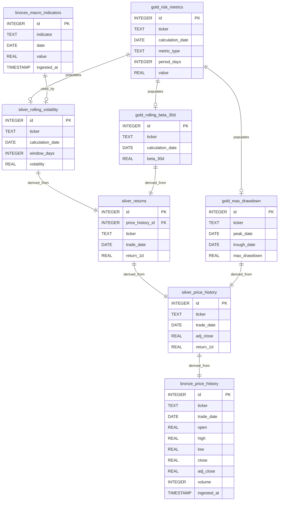

# Stock Risk Engine

A professional-grade financial intelligence pipeline built to forecast volatility and market sensitivity ($\beta$) using Machine Learning and a Medallion Architecture.


## 📝 Project Overview

The **Stock Risk Engine** is an end-to-end predictive analytics platform designed to help Portfolio Managers anticipate systematic risk shifts before they materialize. By combining a **Medallion Data Architecture** with **Random Forest Machine Learning**, the engine transforms raw market data into forward-looking "Beta Drift" forecasts, allowing for proactive rather than reactive hedging. The system dynamically contextualizes stock-specific volatility against multi-tier **VIX Market Regimes**, ensuring that risk signals are always interpreted within the current macro environment.

### Architecture Diagram


### MLOps Automation Architecture
The Stock Risk Engine has been evolved into a fully automated, cloud-native MLOps pipeline. By leveraging GitHub Actions as the primary orchestration layer, the system now performs daily asynchronous data ingestion, feature engineering, and predictive modeling on a scheduled cron-basis. The architecture utilizes a stateless POSIX environment that dynamically initializes a schema-on-run SQLite database, ensuring data integrity across ephemeral runners. Upon successful model inference—which currently prioritizes rolling beta and market regime volatility as primary risk vectors—the system generates a suite of ticker-specific visualizations. These assets, including synthetic stress-test ('Panic') reports, are captured as immutable build artifacts, providing a comprehensive daily audit trail of market risk performance.

1. Trigger: GitHub Actions (via cron or push).
2. Infrastructure (The Wrapper): A Docker Container (Ubuntu/Python Image) that spins up.
3. The Logic (Inside the Container):
    • Python Engine: Processes data and runs ML models.
    • SQLite DB: Ephemerally initialized within the container volume.
4. The Persistence (The Output): Reports are extracted from the container and saved as GitHub Artifacts.


## 🚀 Phase IV: Advanced Quantitative Risk Modeling
In the latest release, the engine has been upgraded to include a multi-engine **Value-at-Risk (VaR)** framework, shifting the focus from historical reporting to predictive downside protection.

### 🧮 Multi-Engine VaR Framework
- **Historical Simulation:** Non-parametric assessment using actual 252-day return distributions.
- **Parametric (Variance-Covariance):** Statistical modeling based on portfolio mean-variance.
- **Monte Carlo Simulation:** 1,000+ stochastic iterations to capture "Fat-Tail" events and non-linear risks.

### 📊 Strategic Risk-Reward Matrix
The engine now generates a dynamic four-quadrant analysis joining **ML-Predicted Beta** (Market Sensitivity) with **Monte Carlo VaR** (Tail-Risk). 

**Current Market Classifications:**
* 🔵 **Efficient (High Beta / Low VaR):** High market sensitivity with resilient downside floors. (e.g., **NVDA**, **TSLA**)
* 🔴 **Aggressive (High Beta / High VaR):** High-growth exposure with significant one-day loss potential.
* 🟡 **Outlier Risk (Low Beta / High VaR):** High idiosyncratic risk despite low market correlation. (e.g., **PG**, **XOM**)
* 🟢 **Defensive (Low Beta / Low VaR):** Institutional "Safe Havens" with minimized downside. (e.g., **CVX**)

 


## 🛠️ Tech Stack

* **Engine:** Python 3.x, Scikit-Learn (Random Forest Regressor).
* **Data Pipeline:** Medallion Architecture (Bronze/Silver/Gold) via SQL & Pandas.
* **Macro Context:** VIX-indexed Market Regime Classification.
* **Visualization:** Plotly (Interactive Dashboards) & FPDF (Executive PDF Reporting).


## Author and Developer

Venkat Rajadurai

## Architecture Overview

This project implements a Medallion Architecture for financial data processing:

* **Bronze Layer (Raw):** Immutable ledger of raw yfinance ingestion. Includes OHLCV data for equities and key macro indicators (Treasury Yields, VIX, S&P 500)
* **Silver Layer (Cleansed):** Deduplicated time-series data with standardized return calculations and rolling volatility metrics.
* **Gold Layer (Analytics):** High-value business logic including Rolling Beta calculations and Portfolio Stress Testing models.

## 📈 Key Quantitative Features

### 1. Rolling Volatility
Calculates the 30-day annualized standard deviation of returns. This helps identify "Volatility Regimes" where a stock's risk profile shifts independently of the market.

σₐₙₙᵤₐₗ = σₔₐᵢₗᵧ × √252

### 2. Rolling Market Beta (β)
Measures the systematic risk of an asset in relation to the S&P 500.
- β > 1: High sensitivity (Aggressive Growth)
- β < 1: Low sensitivity (Defensive/Value)
- β < 0: Inverse correlation (Hedge assets)

### 3. Historical Stress Testing
A simulation engine that identifies the **Maximum 5-Day Drawdown** for a custom-weighted portfolio, providing a realistic view of tail risk during historical market shocks.

### 4. Predictive Beta Drift (Phase II Machine Learning)
A Random Forest Regressor architecture designed to forecast the **5-Day Forward Beta Drift**  ($target\_beta\_drift\_5d$). Unlike static historical beta, this feature predicts how a stock's sensitivity to the market will evolve over the next week.<br>

$$
\hat{\beta}_{t+5} = f( \beta_{130d}, \sigma_{30d}, r_{5d}, VIX ) 
$$

* **Model Input Weights:** The engine weighs **Rolling Beta (38%), Intraday Volatility (34%), and Cumulative Returns (21%)** to identify impending risk expansions or contractions.
* **Significance:** Enables proactive portfolio rebalancing before realized volatility spikes.

### 5. Multi-Tier Market Regime Classification
A dynamic classification system that segments market environments into three distinct risk tiers based on VIX (CBOE Volatility Index) thresholds. This serves as the "Global macro-filter" for all stock-specific predictions.

|Regime|VIX Threshold|Model Behavior|
|---------------|-------------|-----------------------------|
|**Quiet**|**$<15$**|High confidence in stock-specific idiosyncratic signals.|
|**Standard**|**$15−25$**|Balanced weighting between historical beta and current momentum.|
|**Stress**|**$>25$**|High-risk mode; model prioritizes systemic correlation and tail-risk.|

### 6. Idiosyncratic Risk Divergence Analysis
A proprietary logic that isolates "Stock-Specific Noise" from "Market Signals." By comparing price action against a flat VIX environment, the system identifies when a stock (e.g., TSLA or NVDA) is decoupling from the broader S&P 500, signaling a potential break in historical correlation.

## Sample Visualizations

Here are some sample visualizations generated by the `app_visualizer.py`, `app_visualizer2.py` and `app_visualizer3.py` modules. The table below summarizes the key report images used in presentations and PDF reports:

| Figure | Title | Image |
|---:|---|:---|
| 1 | Portfolio Correlation Matrix |  |
| 2 | Risk Analysis Dashboard |  |
| 3 | Risk Analysis with Panic Overlay |  |
| 4 | Predictive Risk Analytics: Beta Drift Forecast (NVDA vs TSLA) |  |
| 5 | Model Validation: Backtest Performance Report |  |

## Tech Stack

* **Language:** Python 3.x
* **Database:** SQLite (File-based, serverless architecture)
* **Data Source:** Yahoo Finance API (yfinance)
* **Libraries:** Pandas, NumPy, SQLAlchemy, SciPy, StatsModels, Matplotlib, Seaborn

## Project Structure

Below is the current repository layout (snapshot taken 2026-02-12) with short descriptions for each folder/file.

```
stock-risk-engine/
├── Dockerfile                      # Optional: container image build instructions
├── environment.yml                 # Conda environment specification
├── init_project.sh                 # Bootstrap helper for fresh clones
├── LICENSE                         # Project license
├── README.md                       # Project documentation (this file)
├── requirements.txt                # Primary pip requirements
├── run_pipeline.sh                 # POSIX script to run the pipeline
├── run_pipeline.bat                # Windows batch to run the pipeline
├── config/                         # Configuration files
│   └── tickers.yml                 # Ticker and macro symbol lists for ingestion
├── data/                           # Storage for raw/processed data
│   └── bronze/                     # Immutable raw ingestion files (OHLCV, macro series)
├── deployment/                     # Deployment artifacts and Docker alternatives
├── docs/                           # Architecture diagrams and sample images
├── reports/                        # Generated HTML/PDF risk reports (artifacts)
├── sql/                            # SQL DDL and analytic view definitions
│   └── init_analytics_layer.sql    # SQL to create analytics views/schema
└── src/                            # Source code
        ├── __init__.py             # Package marker
        ├── main.py                 # Pipeline orchestration (ingest → process → reports)
        ├── core/                   # Core engine logic
        │   └── var_engine.py       # Value-at-Risk and core risk computations
        ├── services/               # Service modules (DB, ingestion, maintenance, reporting)
        │   ├── database.py         # DB connection, schema helpers, ORM models and CRUD utilities (SQLite/SQLAlchemy)
        │   ├── ingestion.py        # Yahoo Finance ingestion, bronze-layer writers and ticker-driven fetch logic
        │   ├── maintenance.py      # Housekeeping: deduplication, retention, archiving and DB compaction
        │   └── reporting.py        # Plotting and report generation helpers (HTML/PDF export, artifact management)
        └── utils/                  # Small utilities and configuration helpers
            └── config.py           # App configuration loader: env var helpers, constants (DATABASE_PATH, REPORT_DIR), and config parsing
```

Directory highlights

- **Root files:** Scripts and environment manifests to reproduce local or CI runs (`environment.yml`, `requirements*.txt`, `run_pipeline.*`).
- **config/**: Centralized settings (tickers, symbols) used by the ingestion and orchestration code.
- **data/**: Implements the Medallion pattern—`bronze/` contains raw ingested files; Silver/Gold are produced into the DB or views during processing.
- **deployment/**: Docker/CI packaging and deployment helpers; alternative Dockerfile backups live here.
- **docs/** and **reports/**: Static assets, diagrams and generated risk reports used for review and distribution.
- **sql/**: DDL and view definitions to build analytics-ready tables used by the Gold layer.
- **src/**: Application code organized into:
    - `core/`: core numerical and risk engine functions (VaR, beta calculations).
    - `services/`: orchestration helpers (DB access, ingestion, maintenance, reporting).
    - `utils/`: configuration and small helpers.

This structure is intentionally small and focused so the pipeline can run locally (SQLite) or be containerized for CI/CD.

## 🚀 Getting Started

**1. Clone the repo:** `git clone <your-repo-url>`<br>
**2. Setup Conda:** `conda env create -f environment.yml`<br>
**3. Configure Tickers:** Edit `config/tickers.yml` to track your preferred assets.<br>
**4. Run Script:** `./run_pipeline.sh` or `./run_pipeline.bat` (This builds the Bronze/Silver/Gold layers and generates the reports in Reports directory).<br>

## Installation & Setup

### Prerequisites
- Python 3.8+
- pip package manager

### Installation Steps

1. **Clone or download the project**
   ```bash
   cd /path/to/your/projects
   # Assuming you have the project folder
   cd stock-risk-engine
   ```

2. **Install dependencies**
   ```bash
   pip install -r requirements.txt
   ```

3. **Initialize the project structure** (optional, if starting fresh)
   ```bash
   chmod +x init_project.sh
   ./init_project.sh
   ```

4. **Set up the database**
   ```bash
   python src/setup_db.py
   ```

## Usage

### Data Ingestion

Run the main pipeline script to fetch stock data from Yahoo Finance and process it:

```bash
python main.py
```

This script will:
- Fetch data for predefined stocks (NVDA, TSLA, XOM, CVX, PG)
- Fetch macro indicators (^TNX, ^IRX, ^GSPC, ^IXIC, ^VIX)
- Save data to the bronze layer in SQLite
- Clean up duplicate entries
- Build analytical views for silver and gold layers
- Perform maintenance tasks like archiving old data

### Custom Data Ingestion

You can modify `main.py` or the ingestion logic in `src/ingestion.py` to fetch data for different stocks or date ranges:

```python
from src.ingestion import DataIngestor
from src.database import create_medallion_schema, run_silver_and_gold_views, update_risk_inference, update_silver_risk_features, update_risk_metrics, get_universe_tickers_from_config, get_spotlight_tickers_from_config
from src.maintenance import archive_old_data
from src.setup_db import create_medallion_schema
from src.app_visualizer import plot_stock_risk, plot_stock_risk_with_panic, plot_correlation_heatmap
from src.config import DATABASE_PATH, REPORT_DIR
from src.app_visualizer2 import run_beta_drift_forecast_report
from src.app_visualizer3 import run_risk_performance_report
import os
import yaml
import argparse
#from src.transformations import run_silver_and_gold_views
#from src.maintenance import archive_old_data

def main():

    parser = argparse.ArgumentParser(description="Run the Stock Risk Engine pipeline.")
    parser.add_argument("--dockermode", action="store_true", help="Run in Docker mode.")
    args = parser.parse_args()

    print(f"Arguments received: {args.dockermode}") 
    docker_mode = args.dockermode

    print("--- Starting Stock Risk Engine ---")

    print(f"Running in {'Docker' if docker_mode else 'Local'} mode.")

    # 1. Initialize the database schema
    if docker_mode:
        print("Initializing database schema in Docker mode...")
        create_medallion_schema(initial_setup=True)
    
    # 2. Ingest Raw Data (Sourcing from tickers.yml inside the module)
    ingestor = DataIngestor()
    ingestor.run_bronze_ingestion()
    
    # 3. Build Analytical Views (SQL-based transformations)
    run_silver_and_gold_views()

    # 4. Update Silver Risk Features
    update_silver_risk_features()

    # 5. Update Risk Metrics
    update_risk_metrics()

    # 6. Update Risk Inference Table
    update_risk_inference()

    # 7. Cleanup & Archive
    archive_old_data()

    print("--- Pipeline Complete ---")

    # 8. Generate Visual Reports

    tickers = get_universe_tickers_from_config()  # Access the tickers list stored during ingestion
    print(f"Generating reports for tickers: {tickers}")

    for ticker in tickers:
        if ticker.startswith("^"):  # Skip indices for individual stock reports
            continue
        else:
            print(f"Generating report for {ticker}...")
            plot_stock_risk(ticker)
            plot_stock_risk_with_panic(ticker)

    plot_correlation_heatmap()

    spotlight_tickers = get_spotlight_tickers_from_config()
    print(f"Generating detailed reports for spotlight tickers: {spotlight_tickers}")    

    run_beta_drift_forecast_report(tickers=spotlight_tickers)
    run_risk_performance_report()

if __name__ == "__main__":
    main()
```

### Entity-Relationship Diagram (ERD)



## Data Dictionary

### Bronze Layer Tables

#### Table: bronze_price_history
| Column | Data Type | Description |
|:--------|:----------|:------------|
| ticker | TEXT | Company ticker symbol |
| date | TEXT | Business or stock trade date (YYYY-MM-DD) |
| open | REAL | Opening trade price for the day |
| high | REAL | Maximum trade price for the day |
| low | REAL | Minimum trade price for the day |
| close | REAL | Closing trade price for the day |
| adj_close | REAL | Adjusted closing trade price for the day |
| volume | INTEGER | Trade volume for the day |

#### Table: bronze_macro_indicators
| Column | Data Type | Description |
|:--------|:----------|:------------|
| indicator | TEXT | Macro indicator symbol (e.g., ^VIX, ^TNX, ^IRX) |
| date | TEXT | Date of the indicator value (YYYY-MM-DD) |
| value | REAL | The numeric value of the macro indicator |
| ingested_at | TIMESTAMP | Timestamp when the record was ingested into the system |

### Silver Layer Tables

#### Table: silver_returns
| Column | Data Type | Description |
|:--------|:----------|:------------|
| ticker | TEXT | Company ticker symbol |
| trade_date | TEXT | Business or stock trade date (YYYY-MM-DD) |
| return_1d | REAL | One-day percentage return calculated from adjusted closing prices |

#### Table: silver_rolling_volatility
| Column | Data Type | Description |
|:--------|:----------|:------------|
| ticker | TEXT | Company ticker symbol |
| calculation_date | TEXT | Date when the volatility was calculated (YYYY-MM-DD) |
| window_days | INTEGER | The rolling window size in days used for volatility calculation |
| volatility | REAL | The annualized rolling volatility for the specified window |

### Gold Layer Tables

#### Table: gold_rolling_beta_30d
| Column | Data Type | Description |
|:--------|:----------|:------------|
| ticker | TEXT | Company ticker symbol |
| calculation_date | TEXT | Date when the beta was calculated (YYYY-MM-DD) |
| beta_30d | REAL | The 30-day rolling beta coefficient measuring systematic risk relative to S&P 500 |

#### Table: gold_max_drawdown
| Column | Data Type | Description |
|:--------|:----------|:------------|
| ticker | TEXT | Company ticker symbol |
| peak_date | TEXT | Date when the price peak occurred (YYYY-MM-DD) |
| trough_date | TEXT | Date when the price trough occurred (YYYY-MM-DD) |
| max_drawdown | REAL | The maximum percentage decline from peak to trough |

#### Table: gold_risk_metrics
| Column | Data Type | Description |
|:--------|:----------|:------------|
| ticker | TEXT | Company ticker symbol |
| calculation_date | TEXT | Date when the metric was calculated |
| metric_type | TEXT | Type of risk metric (e.g., 'volatility', 'beta') |
| period_years | INTEGER | Lookback period in years |
| value | REAL | Calculated metric value |

## Configuration

The project uses configuration files in the `config/` directory. The `tickers.yml` file contains the list of stock tickers and macro indicators to be ingested. Configuration is handled programmatically, with room for expansion to YAML-based settings.

## Development

### Adding New Risk Metrics

1. Extend the database schema in `src/database.py`
2. Add calculation logic in a new module under `src/`
3. Update the ingestion pipeline as needed

### Testing

Currently, the project does not have automated tests. Manual testing can be performed by:
- Running the ingestion scripts
- Verifying data in the SQLite database
- Checking calculated metrics manually

## Contributing

1. Fork the repository
2. Create a feature branch
3. Make your changes
4. Test thoroughly
5. Submit a pull request

## 📈 Key Research Findings (Jan 2024 - Jan 2026)
| Ticker | Max Drawdown | Avg 30D Beta | Risk Category |
|:-------|:-------------|:-------------|:--------------|
| TSLA   | -53.76%      | 1.50         | Aggressive    |
| NVDA   | -21.45%      | 1.96         | High-Growth   |
| ^GSPC  | -18.90%      | 1.00         | Benchmark     |
| PG     | -8.12%       | -0.78        | Defensive     |

## License

This project is licensed under the MIT License - see the LICENSE file for details.

## Disclaimer

This software is for educational and research purposes only. It should not be used for actual investment decisions without proper validation and professional financial advice. Past performance does not guarantee future results.


